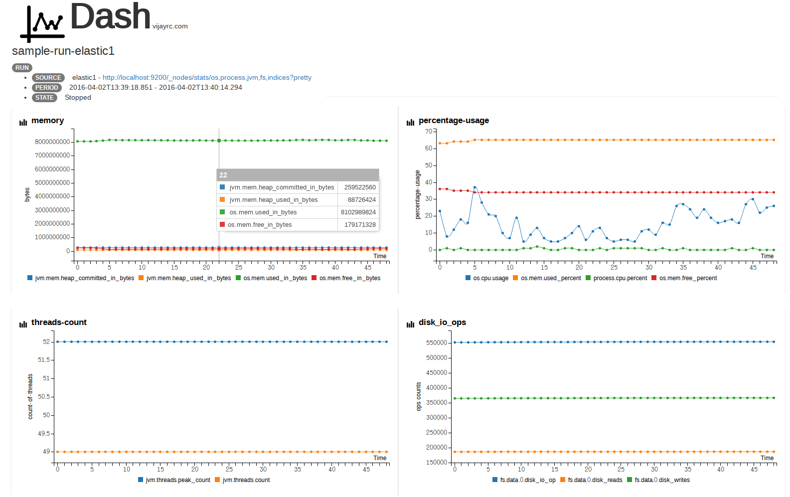

###setup
0. git clone git@github.com:vijayaraj210/dash.git
1. find. -name applicaton.properties | xargs vim
     - configure *config.yaml* location, then inside *config.yml*
        - add  base working dir
        - add **sources** to poll and pull json metric data
        - add **categories** which are groups of json metrics
     - **sample**
          - Here is a sample [config,.yml](https://github.com/vijayaraj210/dash/blob/master/sample-base/config-sample.yml) to pull [metrics](https://github.com/vijayaraj210/dash/blob/master/sample-base/sample-metric.json) from a elasticsearch node.
          - On starting a **run**,  Dash would poll source **elastic1** every 2 sec, write to a json dump
          - On stopping the **run**, Dash would parse the json dump according to the **categories** and produce graphs using d3.js
2. mvn clean package
3.  java -jar dash.jar
4.  dash opens : http://localhost:9195/dash/

###tech
0. java
1. spring-boot
2. handlebar.js
3. c3.js

###todo
0. add time units in X axis
1. improve dashboard user experience
2. show **run** metadata
3. add orientdb as another plugin persistence
4. move to gradle
5. getter higher abtractions to link sources with categories
